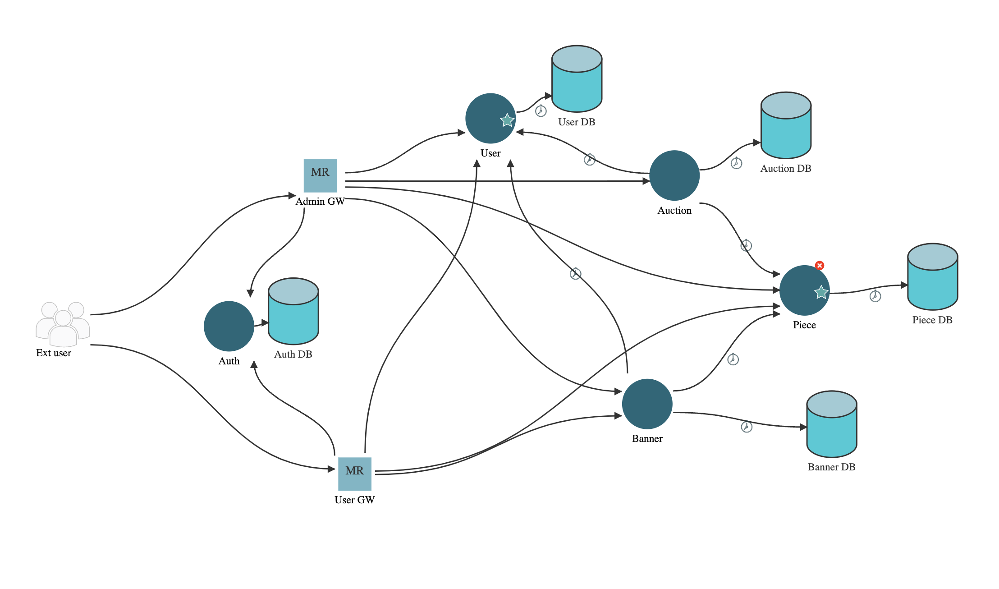

# Chess Heroes 

This repo contains the project for the UNIPI Advanced Software Engineering course.

The project members are:
- Deri Gabriele
- Parlanti Massimo
- Turchetti Gabriele

## Description

The project consists of a gacha game where the gacha items are pieces of chess. A player can buy a packet where it can pull diverse pieces with specific probabilities, or it can obtain the pieces joining the audicions created by other players.

## Get Started

### Server

To run the server:
```
cd server
docker compose up
```

### Client

To install the dependencies for the client:
```
cd client/chess-heroes
npm install
```

To run the client from the chess-heroes folder:
```
npm start
```

### Tests

## Architecture

